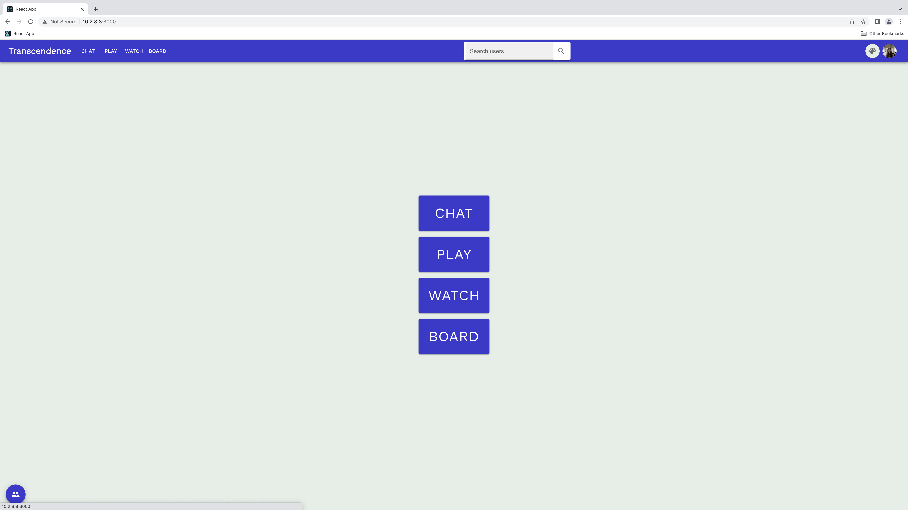
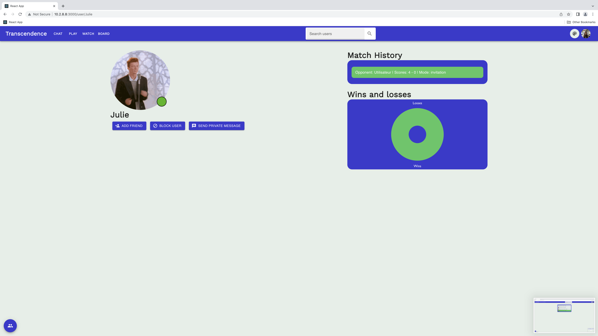
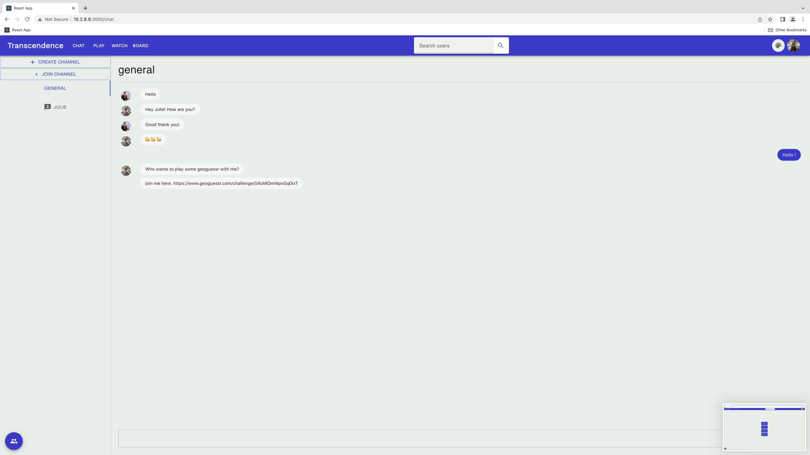
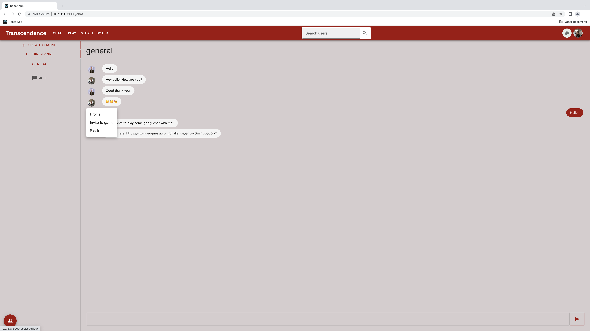
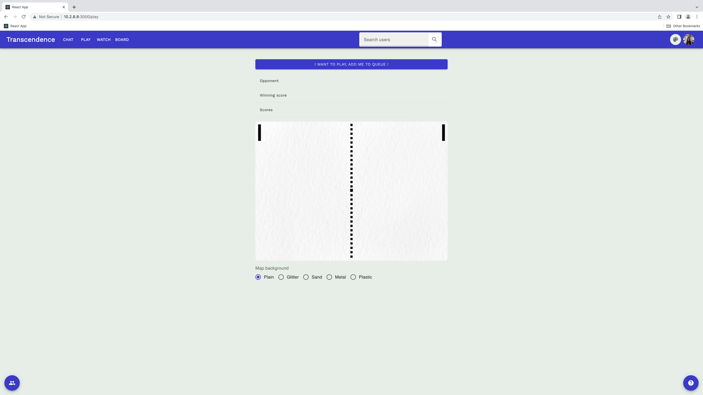
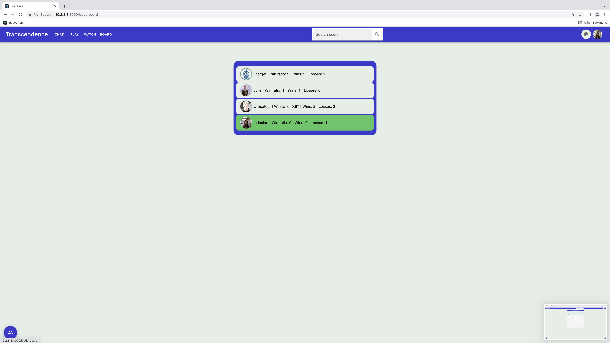

<h1>FT_TRANSCENDENCE</h1>

<h6>Done in collaboration with the amazing goffauxs, adidion19, 2BDia and Viforget</h6>

<h4>Summary</h4>
Ft_transcendence is a website where users can play real-time multiplayer Pong. They connect with the OAuth system of 42 intranet and have access to a chat, a leaderboard, a profile page etc...

The website backend is wrote in NestJs and the front in typescript, using React. The database used for this project is PostgreSQL.

<h4>Installation</h4>

The first thing to do is adding .env with the following :
<code>
POSTGRES_HOST=... 
POSTGRES_PORT=... 
POSTGRES_USER=... 
POSTGRES_PASSWORD=... 
POSTGRES_DB=... 
NESTJS_PORT=... 
COOKIE_SECRET=... 
INTRA_CLIENT_ID=... 
INTRA_CLIENT_SECRET=... 
INTRA_CALLBACK_URL=... 
SALT=... 
REACT_APP_IP=... 
</code>

Run the containers : 
<code>docker-compose up --build</code>

Inspect the database : 
<code>docker exec -it srcs_mariadb_1 bash</code>

<h4>Features</h4>

<h6>User account</h6>

* The user login using the OAuth System of 42 Intranet

* In his user page, they can change their name (the default one is the one from the 42Intranet) and picture.

* They are able to enable two-factor authentication (Google Authenticator).

* On their profile page, they can add other users as friends, block other users (This way, they will see no more messages from the account they blocked) or start a direct conversation with them in a private chat room.

* They can access stats concerning their match history.

* And finally, their current status is displayed (online, offline, in a game).

  

<h6>Chat</h6>

* The users arriving to the chat page land in the general room. From that poitn, they can create channels, that can be public or protected by a password.

* The user who has created a new channel is automatically set as the channel owner until they leave it (in that case the channel is destroyed). The channel owner can set a password required to access the channel, change it, and also remove it. They can set other users as administrators. Channel owners and administrators can ban or mute users for a limited time.

* The users are able to access other players profiles through the chat interface and they can also invite another plyer to a Pong match (invitation that can be accepted or declined).

<h6>Game</h6>

* Users can play a live Pong game versus one another. There is a matchmaking system, where the users can join a queue until they get matched with another player.

* The users can also watch live games.

<h6>Leaderboard</h6>

* The leaderboard displays the current ranking of all the players.

